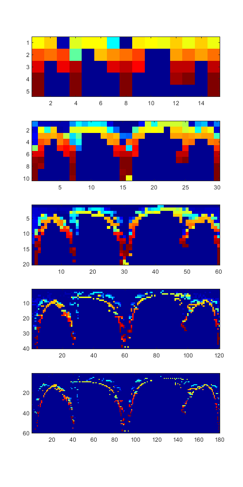
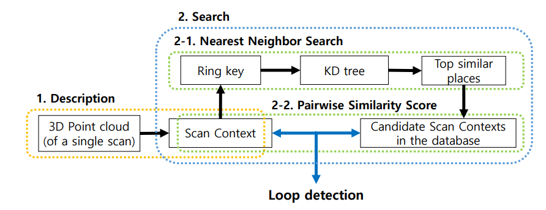
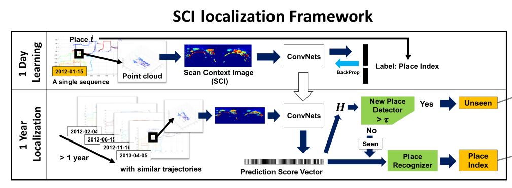

<!-- md preview: Show the rendered HTML markdown to the right of the current editor using ctrl-shift-m.-->

# Scan Context

## NEWS (Dec, 2023): Recent updates 
- The previous official repository `irapkaist/scancontext` will be unavailable soon because the owner `irapkaist` wille be closed (the lab moved to [SNU](https://rpm.snu.ac.kr/)). Therefore, scancontext repository is moving to here. 
- T-RO journal version codes have been added. 
  - See `tro2022` directory. 
    - Particularly, `tro2022/scancontext/desc/ptcloud2cartcontext.m` is the journal version's variation.
    - This directory contains whole helper functions and batch scripts for doing evaluation during the T-RO revision. Thus, the Matlab codes may not be runnable directly, so please use this for reference in understanding the paper.  

## NEWS (Oct, 2021): Scan Context++ is accepted for T-RO!
- Our extended study named Scan Context++ is accepted for T-RO. 
  - Scan Context++: Structural Place Recognition Robust to Rotation and Lateral Variations in Urban Environments
    - [Paper](https://arxiv.org/pdf/2109.13494.pdf), [Summary](https://threadreaderapp.com/thread/1443044133937942533.html), [Video](https://youtu.be/ZWEqwYKQIeg)
- The additional evaluation codes (e.g., lateral evaluations on Oxford Radar RobotCar dataset) with the new metric (we call it recall-distribution based on KL-D) will be added soon. 

## Note
- Scan Context can be easily integrated with any LiDAR odometry algorithms or any LiDAR sensors. Examples are:
  - Integrated with A-LOAM: [SC-A-LOAM](https://github.com/gisbi-kim/SC-A-LOAM)
  - Integrated with LeGO-LOAM: [SC-LeGO-LOAM](https://github.com/irapkaist/SC-LeGO-LOAM)
  - Integrated with LIO-SAM: [SC-LIO-SAM](https://github.com/gisbi-kim/SC-LIO-SAM)
  - Integrated with FAST-LIO2: [FAST_LIO_SLAM](https://github.com/gisbi-kim/FAST_LIO_SLAM)
  - Integrated with a basic ICP odometry: [PyICP-SLAM](https://github.com/gisbi-kim/PyICP-SLAM)
    - This implementation is fully python-based so slow but educational purpose.   
    - If you find a fast python API for Scan Context, use [https://github.com/gisbi-kim/scancontext-pybind](https://github.com/gisbi-kim/scancontext-pybind)
- Scan Context also works for radar.
  - Integrated with yeti-radar-odometry for radar SLAM: [navtech-radar-slam](https://github.com/gisbi-kim/navtech-radar-slam)
    - p.s. please see the ``fast_evaluator_radar`` directory for the radar place recognition evaluation (radar scan context was introduced in [MulRan dataset](https://sites.google.com/view/mulran-pr/home) paper).

## NEWS (April, 2020): C++ implementation
- C++ implementation released!
  - See the directory `cpp/module/Scancontext`
  - Features 
    - Light-weight: a single header and cpp file named "Scancontext.h" and "Scancontext.cpp"
      - Our module has KDtree and we used <a href="https://github.com/jlblancoc/nanoflann"> nanoflann</a>. nanoflann is an also single-header-program and that file is in our directory.
    - Easy to use: A user just remembers and uses only two API functions; `makeAndSaveScancontextAndKeys` and `detectLoopClosureID`.
    - Fast: tested the loop detector runs at 10-15Hz (for 20 x 60 size, 10 candidates)
  - Example: Real-time LiDAR SLAM
    - We integrated the C++ implementation within the recent popular LiDAR odometry codes (e.g., <a href="https://github.com/RobustFieldAutonomyLab/LeGO-LOAM"> LeGO-LOAM </a> and <a href="https://github.com/HKUST-Aerial-Robotics/A-LOAM">A-LOAM</a>).
      - That is, LiDAR SLAM = LiDAR Odometry (LeGO-LOAM) + Loop detection (Scan Context) and closure (GTSAM)
    - For details, see `cpp/example/lidar_slam` or refer these repositories: <a href="https://github.com/irapkaist/SC-LeGO-LOAM">SC-LeGO-LOAM</a> or <a href="https://github.com/gisbi-kim/SC-A-LOAM">SC-A-LOAM</a>.
---


- Scan Context is a global descriptor for LiDAR point cloud, which is proposed in this paper and details are easily summarized in this <a href="https://www.youtube.com/watch?v=_etNafgQXoY"> video </a>.

```
@ARTICLE { gskim-2021-tro,
    AUTHOR = { Giseop Kim and Sunwook Choi and Ayoung Kim },
    TITLE = { Scan Context++: Structural Place Recognition Robust to Rotation and Lateral Variations in Urban Environments },
    JOURNAL = { IEEE Transactions on Robotics },
    YEAR = { 2021 },
    NOTE = { Accepted. To appear. },
}

@INPROCEEDINGS { gkim-2018-iros,
  author = {Kim, Giseop and Kim, Ayoung},
  title = { Scan Context: Egocentric Spatial Descriptor for Place Recognition within {3D} Point Cloud Map },
  booktitle = { Proceedings of the IEEE/RSJ International Conference on Intelligent Robots and Systems },
  year = { 2018 },
  month = { Oct. },
  address = { Madrid }
}
```
- This point cloud descriptor is used for place retrieval problem such as place
recognition and long-term localization.


## What is Scan Context?

- Scan Context is a global descriptor for LiDAR point cloud, which is especially designed for a sparse and noisy point cloud acquired in outdoor environment.
- It encodes egocentric visible information as below:
<p align="center"></p>

- A user can vary the resolution of a Scan Context. Below is the example of Scan Contexts' various resolutions for the same point cloud.
<p align="center"></p>


## How to use?: example cases
- The structure of this repository is composed of 3 example use cases.
- Most of the codes are written in Matlab.
- A directory _matlab_ contains main functions including Scan Context generation and the distance function.
- A directory _example_ contains a full example code for a few applications. We provide a total 3 examples.
 1. _**basics**_ contains a literally basic codes such as generation and can be a start point to understand Scan Context.

 2. _**place recognition**_ is an example directory for our IROS18 paper. The example is conducted using KITTI sequence 00 and PlaceRecognizer.m is the main code. You can easily grasp the full pipeline of Scan Context-based place recognition via watching and following the PlaceRecognizer.m code. Our Scan Context-based place recognition system consists of two steps; description and search. The search step is then composed of two hierarchical stages (1. ring key-based KD tree for fast candidate proposal, 2. candidate to query pairwise comparison-based nearest search). We note that our coarse yaw aligning-based pairwise distance enables reverse-revisit detection well, unlike others. The pipeline is below.
<p align="center"></p>

 3. _**long-term localization**_ is an example directory for our RAL19 paper. For the separation of mapping and localization, there are separated train and test steps. The main training and test codes are written in python and Keras, only excluding data generation and performance evaluation codes (they are written in Matlab), and those python codes are provided using jupyter notebook. We note that some path may not directly work for your environment but the evaluation codes (e.g., makeDataForPRcurveForSCIresult.m) will help you understand how this classification-based SCI-localization system works. The figure below depicts our long-term localization pipeline. <p align="center"></p> More details of our long-term localization pipeline is found in the below paper and we also recommend you to watch this <a href="https://www.youtube.com/watch?v=apmmduXTnaE"> video </a>.
```
@ARTICLE{ gkim-2019-ral,
    author = {G. {Kim} and B. {Park} and A. {Kim}},
    journal = {IEEE Robotics and Automation Letters},
    title = {1-Day Learning, 1-Year Localization: Long-Term LiDAR Localization Using Scan Context Image},
    year = {2019},
    volume = {4},
    number = {2},
    pages = {1948-1955},
    month = {April}
}
```

  4. _**SLAM**_ directory contains the practical use case of Scan Context for SLAM pipeline. The details are maintained in the related other repository _[PyICP SLAM](https://github.com/kissb2/PyICP-SLAM)_; the full-python LiDAR SLAM codes using Scan Context as a loop detector.

## Acknowledgment
This work is supported by the Korea Agency for Infrastructure Technology Advancement (KAIA) grant funded by the Ministry of Land, Infrastructure and Transport of Korea (19CTAP-C142170-02), and [High-Definition Map Based Precise Vehicle Localization Using Cameras and LIDARs] project funded by NAVER LABS Corporation.

## Contact
If you have any questions, contact here please
 ```
 paulgkim@kaist.ac.kr
 ```

## License
 <a rel="license" href="http://creativecommons.org/licenses/by-nc-sa/4.0/"></a><br />This work is licensed under a <a rel="license" href="http://creativecommons.org/licenses/by-nc-sa/4.0/">Creative Commons Attribution-NonCommercial-ShareAlike 4.0 International License</a>.

### Copyright 
- All codes on this page are copyrighted by KAIST and Naver Labs and published under the Creative Commons Attribution-NonCommercial-ShareAlike 4.0 License. You must attribute the work in the manner specified by the author. You may not use the work for commercial purposes, and you may only distribute the resulting work under the same license if you alter, transform, or create the work.
